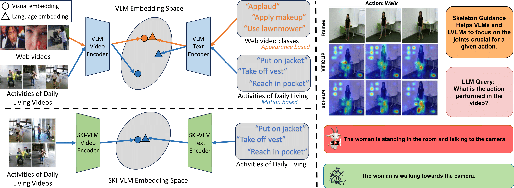

<!-- # Fine-tuned CLIP models are efficient video learners [CVPR 2023] -->
# <u>SKI</u> Models: <u>SK</u>eleton <u>I</u>nduced Vision-Language Embeddings for Understanding Activities of Daily Living (AAAI 2025)
<a href="https://arxiv.org/abs/2502.03459" target="_blank">
        
</a>
This is the official repository of 'SKI Models: Skeleton Induced Vision-Language Embeddings for Understanding Activities of Daily Living' (AAAI 2025).



> **<p align="justify"> Abstract:** *The introduction of vision-language models like CLIP has enabled the development of foundational video models capable of generalizing to unseen videos and human actions. However, these models are typically trained on web videos, which often fail to capture the challenges present in Activities of Daily Living (ADL) videos. Existing works address ADL-specific challenges, such as similar appearances, subtle motion patterns, and multiple viewpoints, by combining 3D skeletons and RGB videos. However, these approaches are not integrated with language, limiting their ability to generalize to unseen action classes.* <br>
> *In this paper, we introduce <b>SKI models</b>, which integrate 3D skeletons into the vision-language embedding space. SKI models leverage a skeleton-language model, <b>SkeletonCLIP</b>, to infuse skeleton information into Vision Language Models (VLMs) and Large Vision Language Models (LVLMs) through collaborative training. Notably, SKI models do not require skeleton data during inference, enhancing their robustness for real-world applications. The effectiveness of SKI models is validated on three popular ADL datasets for zero-shot action recognition and video caption generation tasks.* </p>

## Installation
This codebase is tested on Ubuntu 20.04.2 LTS with python 3.8. Follow the below steps to create environment and install dependencies. 

* Setup conda environment (recommended).
```bash
# Create a conda environment
conda create -y -n ski_env python=3.7
# Activate the environment
conda activate ski_env
# Install requirements
pip install -r requirements.txt
```

* Install Apex for enabling mixed-precision training.

NOTE: Make sure to have system CUDA of same version as of PyTorch CUDA version to properly install apex.
```
git clone https://github.com/NVIDIA/apex
cd apex
pip install -v --disable-pip-version-check --no-cache-dir --global-option="--cpp_ext" --global-option="--cuda_ext" ./
```

# SKI-VLM

## Data Preparation
We use the datasets [NTU RGB+D](https://rose1.ntu.edu.sg/dataset/actionRecognition/), and [NTU RGB+D 120](https://rose1.ntu.edu.sg/dataset/actionRecognition/). The zero-shot train and test splits are provided in the [labels](labels/) directory. Based on the splits, create the train and test csv files in the following format: 

```
path_to_video_1,path_to_video_1_skeleton,label_1
path_to_video_2,path_to_video_2_skeleton,label_2
...
path_to_video_N,path_to_video_N_skeleton,label_N
```

## Training
For all experiments, we provide config files in [configs](configs/) directory. For example, to train SKI-VLM on NTU, after setting the paths in the config file and bash scripts, run the following commands:
```
bash scripts/train_p1_SkeletonCLIP.sh
bash scripts/train_p2_SKIViFiCLIP.sh
```

## Evaluating models
To evaluate a model, please use a suitable config and corresponding model weights and run the command below:
```
bash scripts/eval_SKIViFiCLIP.sh
```

# SKI-LVLM
For SKI-LVLM, we provide a script to evaluate the model on the Charades dataset. Please refer to the [SKI-LVLM README](SKI_LVLM/README.md) for more details.

# Acknowledgements
We sincerely thank the authors of [ViFi-CLIP](https://github.com/muzairkhattak/ViFi-CLIP), [Hyperformer](https://github.com/ZhouYuxuanYX/Hyperformer), and [LLAVIDAL](https://github.com/ADL-X/LLAVIDAL) for providing the codebases.
